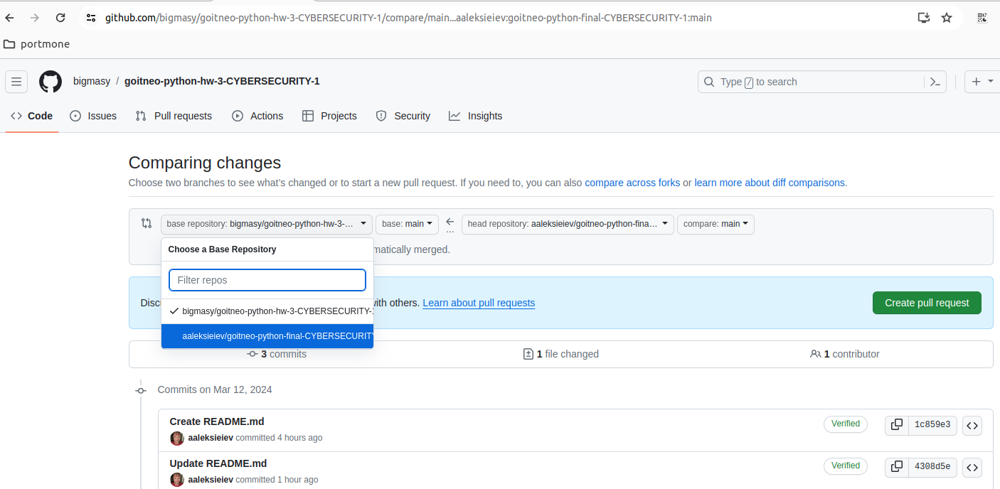

Застосунок "Адресна книга"
=======

Вимоги
----------
None

Перелік функцій застосунка
-----------
Available contact commands:
  - add-contact: Add a new contact.
  - change-contact: Change a field for an existing contact.
  - delete-contact: Delete a contact by name.
  - find-contact: Find and display a contact by any field.
  - all-contact: Display all contacts.
  - birthdays: Display contacts who have birthdays within a specified number of days.
  - help: Display this help message.
Available note commands:
  - add-note: Add a new note (title and text).
  - change-note: Change the text of a note.
  - delete-note: Delete a note by title.
  - add-tag: Add a tag to a note.
  - delete-tag: Remove a tag from a note.
  - find-note: Search and display a note by tag or title.
  - all-note: Display all notes.
  - help-note: Display this help message.

Правила розробки
-----------
Використання git

# Увага! 
Коли створюєте "Запит на зміни" обрайте назву репозиторію "aaleksieiev/goitneo-python-final-CYBERSECURITY-1"



1) Головна гілка репозиторія називається main. Для кожної задачі створюється нова гілка скопійована з головної. Для назви гілки використовуйте код вказаний в назві задачі.
Приклад результату виконання команд в git: 
```
$ git status
On branch main
Your branch is up to date with 'origin/main'.

nothing to commit, working tree clean
```
```
$ git checkout -b RAB-10
Switched to a new branch 'RAB-10'
```
2) При збережені задач в репозиторії використовуйте короткий опис проведеної роботи.
Приклад результату виконання команд в git: 
```
$ git status
On branch RAB-10
Changes not staged for commit:
  (use "git add <file>..." to update what will be committed)
  (use "git restore <file>..." to discard changes in working directory)
        modified:   README.md

no changes added to commit (use "git add" and/or "git commit -a")
```
```
$ git add .
```
```
$ git commit -m "RAB-10: правило роботи з git"
[RAB-10 431b1f8] RAB-10: правило роботи з git
 1 file changed, 16 insertions(+), 2 deletions(-)
```
3) Перед відправленням змін на сервер треба впевнитися, що гілка задачі сумісна з найсвежішою версією гілки main
```
$ git fetch
remote: Enumerating objects: 5, done.
remote: Counting objects: 100% (5/5), done.
remote: Compressing objects: 100% (3/3), done.
remote: Total 3 (delta 1), reused 0 (delta 0), pack-reused 0
Unpacking objects: 100% (3/3), 965 bytes | 965.00 KiB/s, done.
From github.com:aaleksieiev/goitneo-python-final-CYBERSECURITY-1
   4308d5e..2be7f29  main       -> origin/main
```
```
$ git merge origin main
Auto-merging README.md
Merge made by the 'ort' strategy.
 README.md | 2 --
 1 file changed, 2 deletions(-)
```
```
$git push origin RAB-10
Enumerating objects: 10, done.
Counting objects: 100% (10/10), done.
Delta compression using up to 8 threads
Compressing objects: 100% (6/6), done.
Writing objects: 100% (6/6), 1.19 KiB | 1.19 MiB/s, done.
Total 6 (delta 1), reused 0 (delta 0), pack-reused 0
remote: Resolving deltas: 100% (1/1), done.
remote: 
remote: Create a pull request for 'RAB-10' on GitHub by visiting:
remote:      https://github.com/aaleksieiev/goitneo-python-final-CYBERSECURITY-1/pull/new/RAB-10
remote: 
To github.com:aaleksieiev/goitneo-python-final-CYBERSECURITY-1.git
 * [new branch]      RAB-10 -> RAB-10
```
4) Після успішного збереження змін перейдіть у веб інтерфейс github і створіть "Запит на додавання"

5) Пересуньте задачу в колонку review. Зберіть два схавлення на "Запит на додавання" від колег

6) Злийте "Запит на додавання" з гілкою main. Проведіть випробування гілки main з вашими змінами. Застосунок має працювати. Функції перелічени в розділі "Перелік функцій застосунка" мають працювати.